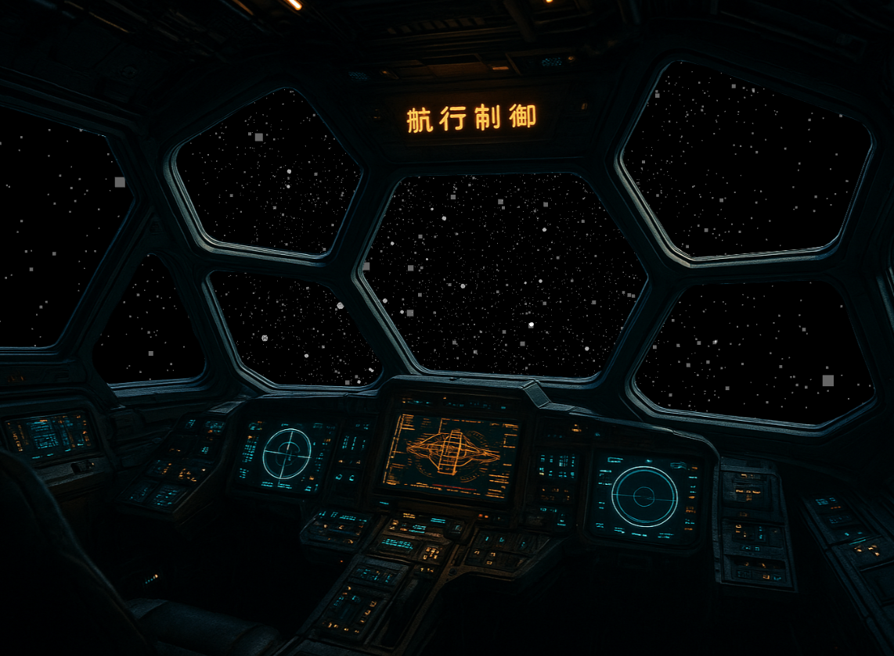

# 
# Audio Spaceship Visualizer


A standalone React application that creates an immersive, audio-reactive 3D Visualizer. The application uses the Web Audio API to analyze microphone input in real-time and **Three.js** to visualize that data as a starfield and asteroid belt that reacts to bass, mid, and treble frequencies.

## 🚀 Features

* **Real-time Audio Analysis:** converting microphone input into frequency data (Bass, Mid, Treble).
* **3D Particle System:** A moving starfield that accelerates based on audio volume.
* **Reactive Asteroids:** 3D Icosahedrons that rotate, scale, and change color based on specific frequency bands.
* **Cockpit Overlay:** A static overlay to simulate a spaceship view.
* **Responsive:** Full-screen canvas that resizes dynamically with the browser window.

---

## 🛠️ Tech Stack

* **Frontend:** React (Vite)
* **3D Graphics:** Three.js
* **Deployment:** Nginx on Ubuntu

---

## 📦 Installation & Local Development

1. **Clone the repository** (or navigate to your folder):
    ```bash
    cd visualizer
    ```

2. **Install Dependencies:**
    ```bash
    npm install
    ```
    *Note: This project requires `three` and standard React dependencies.*

3. **Run Locally:**
    ```bash
    npm run dev
    ```
    Open `http://localhost:5173/` in your browser.

---

```text
visualizer/
├── dist/               # Compiled production code (Upload THIS to server)
├── public/             # Static assets
├── src/
│   ├── App.css         # Global styles & Fullscreen resets
│   ├── App.jsx         # Main React Component wrapper
│   ├── main.jsx        # Entry point
│   └── Visualizer.jsx  # CORE LOGIC: Audio + Three.js
├── index.html          # HTML Entry + Google Analytics
├── package.json        # Dependencies
└── vite.config.js      # Build configuration
